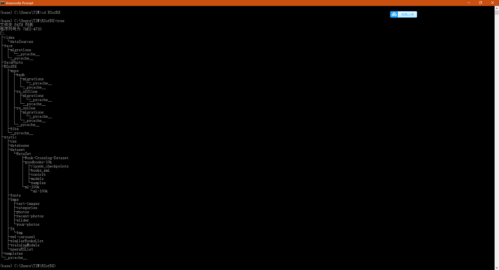
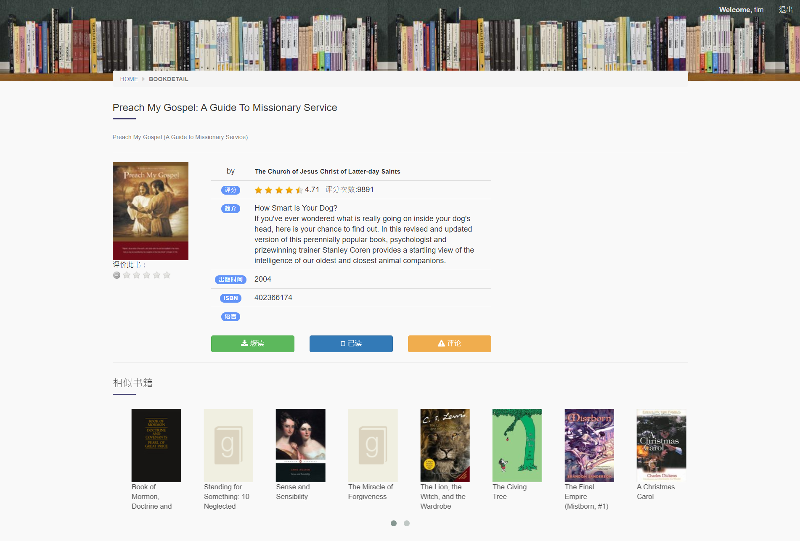
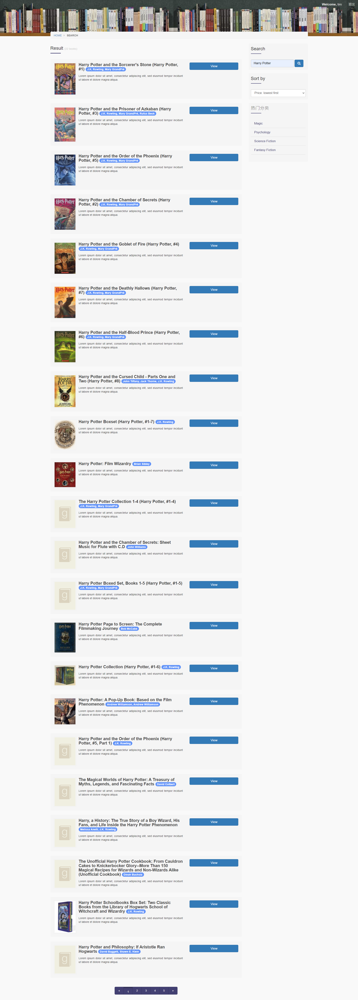
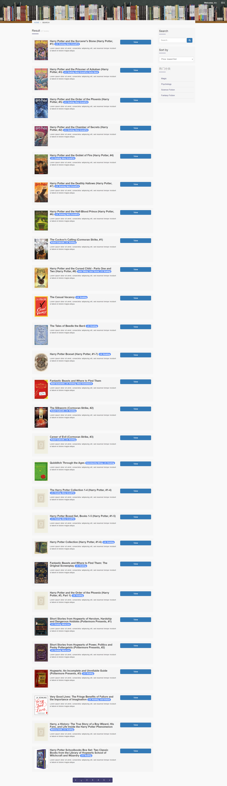

# 融合人脸识别登录的图书推荐系统 Book Recommendation System Integrating Face Recognition And Login

##### 注：本项目是笔者的2020年全国大学生计算机设计大赛参赛作品
##### Note: this project is the author's entry in the 2020 national college student computer design competition(China)
***
* ## 项目结构 Project Structure

* face文件夹，是人脸识别系统的APP。
* facePhoto文件夹，是存放人脸图片的人脸库。
* static文件夹，是用来存放前端静态文件、数据集、训练集的文件夹。
* templates文件夹，故名思意是存放模板的文件夹，“模板”即是需要渲染的静态页面。

* The face folder is the app of the face recognition system.
* Facephoto folder is the face database for storing face pictures.
* Static folder is a folder used to store front-end static files, data sets and training sets.
* Templates folder, so its name means the folder where templates are stored. "Template" is the static page that needs to be rendered.
***

* ## 几点说明
1. 很明显，这里不是这个项目的全部。由于一些数据集和训练集比较大，而GitHub和Gitee要求每个文件不能超过100Mb的大小，所以删掉了一些CSV文件还有所有的训练集文件（训练集好几个G，实在太大了）。
2. 还有，这个项目不是我一个人独立完成的。从工程目录肉眼可见，它分为两个APP：一个是图书推荐系统相关的APP（RSofBX），而另一个是人脸识别系统相关的APP（face）。我负责完成的是人脸识别相关的APP，这个是我独立完成的。而图书推荐系统是学长写的，由于推荐系统工作量较大而且我比他跟熟悉Django，所以我也帮他写了些简单的页面响应函数来减轻他的负担。
3. 其它两个学弟负责项目的测试和调试。
4. 关于数据集：我们采用的是开源的1000-goodbooks的数据集，数据基本没有太多的错误，有错的数据在由CSV文件导入到MySQL时也会因为错误而无法写入，所以可以有效的解决数据的稀疏性。而项目一开始使用爬虫，爬豆瓣网的书，一是费时，二是由于豆瓣有反爬措施，总是锁IP使得程序中断，有时候数据还有错，总之来说效率极低，所以改用了1000-goodbooks的数据集。

* ## Some Notes
1. Obviously, this is not the whole project. Because some data sets and training sets are relatively large, and GitHub and gitee require that each file cannot exceed 100MB, some CSV files and all training set files are deleted (the training set has several G, which is too large).
2. Also, I didn't finish this project alone. Visible to the naked eye from the project directory, it is divided into two apps: one is the app related to book recommendation system (rsofbx), and the other is the app related to face recognition system (face). I am responsible for completing the app related to face recognition, which I completed independently. The book recommendation system is written by the senior. Because the workload of the recommendation system is large and I am more familiar with Django than him, I also helped him write some simple page response functions to reduce his burden.
3. The other two students are responsible for the test and commissioning of the project.
4. About data sets: we use the open source 1000 goodbooks data set. There are basically no too many errors in the data. The wrong data can not be written due to errors when importing from CSV file to MySQL, so it can effectively solve the sparsity of data. At the beginning of the project, the crawler and Douban book were used. First, it was time-consuming. Second, Douban always locked the IP to interrupt the program. Sometimes the data was still wrong. In short, the efficiency was very low, so the data set of 1000 goodbooks was used.
***

* ## 关于推荐算法
这不是我的专长，这些功能主要是学长完成的。由于我为了帮他写些简单的响应函数，我特地的恶补一些推荐算法的基础知识，所以我在这把我知道的一点写出来，以供大家参考。  
使用的是混合推荐，主要有这几个算法：TopN、K-Means、KNN、SVD。具体可以看RSofBX的views.py文件。
* ## About Recommendation Algorithm
This is not my specialty. These functions are mainly completed by senior students. In order to help him write some simple response functions, I specially complement the basic knowledge of some recommended algorithms, so I write what I know here for your reference.
Hybrid recommendation is used, mainly including these algorithms: topn, K-means, KNN and SVD. See rsofbx's views Py file.
***

* ## 关于人脸识别的实现
使用的是openCV进行人脸检测，人脸比对是使用的是基于Dlib和Cmake的face_recognition库。不出意料，这个库安装时会出现各种错误，具体都可以自行百度或者谷歌解决。

* ## About the Realization of Face Recognition
Opencv is used for face detection, and face comparison is based on Dlib and cmake_ Recognition library. Not surprisingly, there will be various errors during the installation of this library, which can be solved by BaiDu or Google itself.
***
* ## 如何运行？
这是一个基于Django框架的WEB项目，所以直接按照Django的启动方法启动即可。所以，用CMD进入工程文件夹，键入“*python manage.py runserver*”即可，然后在浏览器里键入*127.0.0.1:8000*即可访问。

* ## How Does it Work?
This is a web project based on Django framework, so you can start it directly according to Django's startup method. Therefore, use CMD to enter the project folder, type "* Python manage. Py runserver *" and then type * 127.0.0.1:8000 * in the browser to access it.
***

* ## 作品展示图
* ## Show My Works
1. 人脸识别登录页面展示Display of face recognition login page

2. 未登录时的图书推荐页面Book recommendation page when not logged in

3. 登录后的图书推荐页面Book recommendation page after login

4. 用户登录界面User login interface

5. 图书详情页Book details page

6. 搜索页面（搜索书名，以《哈利波特》为例）Search page (search the title of the book, taking Harry Potter as an example)

7. 搜索页面（搜索作者名字，以JK罗玲为例）Search page (search the author's name, taking JK Luo Ling as an example)

***
结束

END

